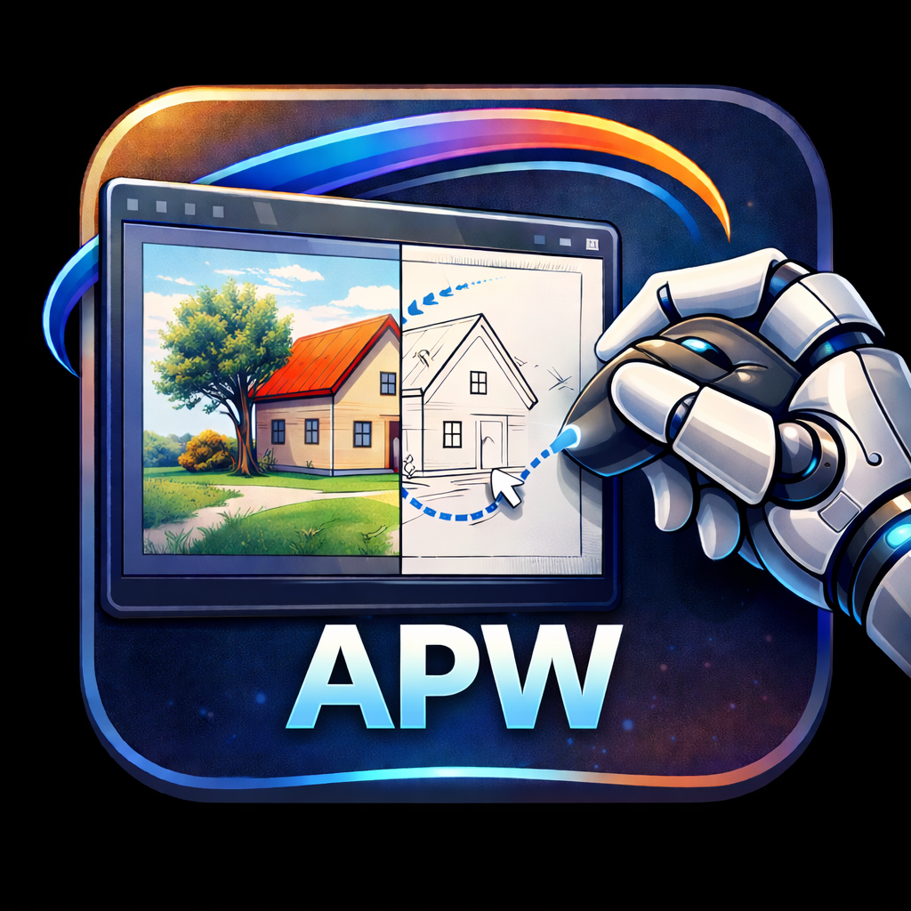

# AutoPainter Win



AutoPainter Win 是一个基于 PyQt5 的桌面应用，用于将图片转换为线稿，并提供自动绘画相关的界面与核心模块。

## 功能概览

- 图片转线稿
- 多种线稿风格：
  - Pencil
  - Pen
  - Ink
  - Comic
  - Contour
  - AI（当前界面中为预留选项）
- 可调参数：
  - 线条粗细
  - 对比度
  - 阈值
  - 反色
- 原图 / 线稿对比预览
- 中英文界面切换
- 文本渲染模式，可将输入文字生成黑白路径图用于后续绘制

## 当前状态

- 线稿生成功能已接入桌面界面
- 自动绘画相关核心代码位于 `core/auto_painter.py`
- GUI 中的“开始绘画”流程目前仍为演示型进度逻辑，尚未在界面线程中完整接入真实自动绘画实现

## 环境要求

- Python 3.9+
- Windows（自动绘画相关能力面向 Windows 使用场景）

依赖见 `requirements.txt`：

- PyQt5
- opencv-python
- numpy
- pyautogui

## 安装

```bash
pip install -r requirements.txt
```

## 运行

```bash
python main.py
```

启动后可按以下流程使用：

1. 打开图片
2. 选择线稿风格
3. 调整线条粗细、对比度、阈值等参数
4. 生成并预览线稿
5. 需要时保存线稿，或切换到文字模式生成文本图像

## 项目结构

```text
auto-painter-win/
├── main.py                 # 应用入口
├── core/
│   ├── sketch_generator.py # 线稿生成核心
│   ├── auto_painter.py     # 自动绘画相关逻辑
│   └── utils.py            # 图像读取与缩放等工具
├── ui/
│   ├── main_window.py      # 主窗口
│   ├── control_panel.py    # 左侧控制面板
│   ├── preview_panel.py    # 预览面板
│   ├── text_panel.py       # 文字模式面板
│   └── i18n.py             # 中英文翻译
└── requirements.txt
```

## 说明

目前仓库中未包含现成的自动化测试或构建配置，主要通过本地运行桌面程序进行验证。
